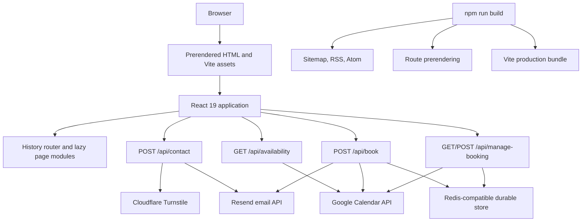

[](https://www.guuleedmaxamuud.dev/)
[](https://react.dev/)
[](https://www.typescriptlang.org/)
[](https://vite.dev/)
[](https://tailwindcss.com/)
[](https://nodejs.org/api/test.html)
[](https://developers.cloudflare.com/turnstile/)
[](#license)

# Guuleed Maxmuud Aw Abdi: Full-Stack Portfolio

The source code for [guuleedmaxamuud.dev](https://www.guuleedmaxamuud.dev/), a production-oriented personal portfolio, interactive CV, technical blog, contact service, and calendar booking application.

This is more than a collection of static resume sections. It is a typed React application with direct URL routing, prerendered HTML, dynamic SEO metadata, Markdown publishing, social image generation, a Resend-powered contact workflow, and a Google Calendar booking system with availability checks, Google Meet links, cancellation, rescheduling, durable idempotency, and abuse controls.

The site represents Guuleed Maxmuud Aw Abdi, a full-stack developer and DevOps-minded engineer based in Hargeisa, Somaliland. The content highlights frontend architecture, backend APIs, automation, delivery workflows, secure engineering, vulnerability assessment, penetration testing, technical writing, and verified learning.

> **Live application:** [www.guuleedmaxamuud.dev](https://www.guuleedmaxamuud.dev/)

## Table of contents

- [What this project is](#what-this-project-is)
- [Goals and design principles](#goals-and-design-principles)
- [Architecture at a glance](#architecture-at-a-glance)
- [Technology stack](#technology-stack)
- [Repository structure](#repository-structure)
- [Frontend documentation](#frontend-documentation)
- [Routing and URLs](#routing-and-urls)
- [Backend and API documentation](#backend-and-api-documentation)
- [Contact workflow](#contact-workflow)
- [Booking workflow](#booking-workflow)
- [Security model](#security-model)
- [Blog and publishing system](#blog-and-publishing-system)
- [SEO, feeds, and prerendering](#seo-feeds-and-prerendering)
- [Static assets and media](#static-assets-and-media)
- [Configuration and environment variables](#configuration-and-environment-variables)
- [Local development](#local-development)
- [NPM scripts](#npm-scripts)
- [Testing and verification](#testing-and-verification)
- [Production deployment](#production-deployment)
- [Operations and troubleshooting](#operations-and-troubleshooting)
- [How to update the site](#how-to-update-the-site)
- [Known implementation notes](#known-implementation-notes)
- [Roadmap](#roadmap)
- [License](#license)
- [Contact](#contact)

## What this project is

### Product surface

The application combines several public experiences behind one consistent visual system:

| Area | Purpose | Primary implementation |
| --- | --- | --- |
| Home | First impression, positioning, metrics, calls to action, and navigation into the rest of the portfolio | `src/pages/Home.tsx` |
| About | Personal introduction, working style, soft skills, languages, and background | `src/pages/About.tsx`, `src/constants.ts` |
| Capabilities | Technical skills, tools, courses, and security-oriented competencies | `src/pages/Skills.tsx`, `src/constants.ts` |
| Experience | Work history and measurable engineering/security outcomes | `src/pages/Experience.tsx`, `src/constants.ts` |
| Learning | Certificates and external verification links | `src/pages/Certificates.tsx`, `src/constants.ts` |
| Selected work | Project overview and detailed case studies | `src/pages/Portfolio.tsx`, `src/pages/ProjectDetail.tsx` |
| Book a call | Calendar availability, Google Meet booking, management, cancellation, and rescheduling | `src/pages/BookCall.tsx`, `api/*.ts` |
| Blog | Searchable technical article catalog and Markdown reader | `src/pages/Blog.tsx`, `src/blog/` |
| Contact | Protected contact form and direct contact alternatives | `src/pages/Contact.tsx`, `api/contact.ts` |
| Legal | Privacy policy and terms of service | `src/pages/Legal.tsx` |
| Annual reflection | Seasonal/annual reflection view, normally exposed on July 27 or through its aliases | `src/pages/AnnualRecap.tsx` |

### What makes the application technically interesting

- React pages are lazy-loaded from the root application to reduce the initial JavaScript payload.
- The browser uses a lightweight history-based router implemented in `src/routing.ts` rather than a full routing dependency.
- The same page components are used by the browser application and the Node prerenderer through `src/ssr/StaticRoute.tsx`.
- Every public route receives route-specific title, description, canonical URL, robots policy, Open Graph data, Twitter card data, and JSON-LD.
- Blog posts are portable Markdown files with validated frontmatter and are imported in the browser with Vite's `import.meta.glob` and in Node scripts with a filesystem fallback.
- The booking flow treats Google Calendar as the source of truth for busy times and uses a durable Redis-compatible store for booking records, idempotency keys, and rate-limit counters.
- Contact and booking forms use server-side validation and Cloudflare Turnstile verification; the browser widget alone is never treated as sufficient protection.
- Vercel headers provide a restrictive baseline for framing, MIME sniffing, referrers, transport security, permissions, and content sources.

## Goals and design principles

### Content first

The site is structured as a professional narrative: identity and value proposition first, then capabilities, evidence, work history, learning, case studies, writing, and contact. Profile content is centralized in `src/constants.ts` so updates do not require hunting through page markup.

### Typed boundaries

Shared content models live in `src/types.ts`. API input validation lives in `src/server/validation.ts`. Blog frontmatter is parsed and checked before it becomes a `BlogPost`. TypeScript runs with `noEmit` and bundler module resolution through `tsconfig.json`.

### Progressive enhancement

The application remains useful as a prerendered document. `scripts/prerender.ts` creates route-specific HTML files for crawlers, link unfurlers, slow clients, and direct navigation. Once the browser JavaScript loads, React adds navigation interception, animations, theme state, terminal controls, blog interactions, and booking interactions.

### Security-minded defaults

The code treats external input as untrusted, sanitizes rendered Markdown, restricts Markdown URL protocols, escapes HTML inserted into email templates, avoids storing raw booking tokens, and fails closed when durable booking protection is unavailable.

## Architecture at a glance



### Request and rendering model

1. Vite serves the development application on port `3000`.
2. In production, `vite build` creates the client bundle in `dist/`.
3. The build scripts generate `public/sitemap.xml`, `public/rss.xml`, and `public/atom.xml` before bundling.
4. `scripts/prerender.ts` renders the public routes into `dist/**/index.html` and creates `dist/404.html`.
5. Vercel serves static route files and invokes API functions under `/api/*`.
6. The browser enhances the static markup and intercepts same-origin known-route links with `history.pushState`.

## Technology stack

### Runtime and application

| Layer | Technology | Why it is present |
| --- | --- | --- |
| UI | React `19.0.1` | Component-based rendering and hooks |
| Language | TypeScript `~5.8.2` | Typed content, UI state, and server modules |
| Build | Vite `8.2.1` | Development server, bundling, HMR, and asset processing |
| CSS | Tailwind CSS `4.1.14` | Utility styling and design tokens |
| Tailwind integration | `@tailwindcss/vite` | Vite-native Tailwind compilation |
| Motion | `motion` `12.23.24` | Page transitions, reader transitions, and reduced-motion-aware animation |
| Icons | `lucide-react` `0.546.0` | UI iconography |
| Head management | `react-helmet-async` `3.0.0` | Runtime page metadata |
| Markdown | `react-markdown` `10.1.0` | Article rendering |
| Markdown extensions | `remark-gfm` and `rehype-sanitize` | GitHub-Flavored Markdown and HTML sanitization |

### Server and integration packages

| Package/service | Responsibility |
| --- | --- |
| Vercel Functions | Hosts files in `api/` as server endpoints |
| `resend` | Sends contact and booking confirmation email |
| `googleapis` | OAuth and Google Calendar availability/event operations |
| `date-fns` and `date-fns-tz` | Calendar windows, weekday rules, formatting, and timezone conversion |
| `dotenv` | Available for local/server environment loading |
| `@vercel/og` | Generates article Open Graph images |
| Redis protocol or REST store | Durable booking records, idempotency, and rate limiting |
| Cloudflare Turnstile | Human/bot verification for contact and booking submissions |

### Development and verification

| Tool | Use |
| --- | --- |
| `tsx` | Runs TypeScript scripts and the Node test suite without a separate compile step |
| Node built-in `node:test` | Unit tests in `tests/` |
| `tsc --noEmit` | Type checking via `npm run lint` |
| Vite manual chunks | Separates React, Motion, icons, and other vendor code where configured |

## Repository structure

```text
.
├── api/                         # Vercel serverless API handlers
│   ├── availability.ts          # Google Calendar-backed month/day availability
│   ├── blog-seo.ts              # Dynamic fallback article metadata response
│   ├── book.ts                  # Create a calendar booking
│   ├── contact.ts               # Protected contact form delivery
│   ├── manage-booking.ts        # Read, cancel, or reschedule a booking
│   ├── oauth2callback.ts         # Google Calendar OAuth setup helper
│   └── og-image.tsx              # Dynamic 1200x630 article image endpoint
├── public/                      # Files copied directly to the deployed site
│   ├── assets/                  # Downloadable and social media assets
│   ├── images/                  # Optional themed media collections
│   ├── atom.xml                 # Generated Atom feed checked into this workspace
│   ├── robots.txt               # Crawler policy
│   ├── rss.xml                  # Generated RSS feed checked into this workspace
│   ├── site.webmanifest         # Install metadata for supported browsers
│   └── sitemap.xml              # Generated canonical URL list
├── scripts/
│   ├── copy_icons.js            # Icon synchronization helper
│   ├── generate-feeds.ts        # RSS and Atom generation
│   ├── generate-sitemap.ts      # Sitemap generation
│   ├── google-oauth-helper.ts   # Local OAuth support utility
│   ├── prerender.ts             # Static route rendering and metadata injection
│   └── verify-seo.ts             # Built-output SEO assertions
├── src/
│   ├── blog/                    # Markdown discovery, frontmatter, and posts
│   ├── booking/                 # Slot rules and booking constants
│   ├── components/              # Shared React components
│   ├── config/                  # Feature data/configuration
│   ├── data/                    # Project detail data
│   ├── hooks/                   # Reusable client hooks
│   ├── pages/                   # Route-level page components
│   ├── seo/                     # Metadata and JSON-LD factories
│   ├── server/                  # Shared server-side validation/storage/services
│   ├── ssr/                     # Static route renderer
│   ├── App.tsx                  # Browser shell, navigation, theme, lazy pages
│   ├── constants.ts             # Profile, experience, skills, certificates, projects
│   ├── index.css                # Global CSS, theme variables, component styles
│   ├── main.tsx                 # Browser entry point
│   ├── routing.ts               # URL-to-section and legacy hash mapping
│   └── types.ts                 # Shared TypeScript content interfaces
├── tests/                       # Unit tests for routing, booking, Markdown, terminal, APIs
├── index.html                   # HTML shell and baseline homepage metadata
├── metadata.json                # Project metadata
├── package.json                 # Dependencies and scripts
├── postcss.config.mjs           # PostCSS setup
├── tsconfig.json                # TypeScript compiler settings
├── vercel.json                  # Headers, redirects, and OG image rewrite
└── vite.config.ts               # Vite plugins, aliases, target, and chunking
```

## Frontend documentation

### Application shell: `src/App.tsx`

`App` owns the global browser experience:

- Initializes the active section from `window.location.pathname`.
- Detects project slugs under `/portfolio/:slug`.
- Lazy-loads all route-level page modules with `React.lazy` and renders them through `Suspense`.
- Maintains the light/dark theme state and writes `data-theme` plus `color-scheme` to the document root.
- Installs a `popstate` listener for browser back/forward navigation.
- Intercepts ordinary same-origin links for known routes and updates history without a full page reload.
- Converts legacy hash URLs such as `#about` into pathname URLs.
- Provides the global terminal keyboard shortcut `Ctrl+Alt+G` on Windows/Linux or `Cmd+Alt+G` on macOS.
- Enables annual reflection navigation on July 27 and whenever the recap route is active.
- Hides the surrounding navigation chrome while Blog focus mode is active.
- Renders `SeoHead`, `BirthdayConfetti`, navigation, terminal UI, the lazy page, and the footer.

### Route-level pages

The page modules are intentionally focused on their public experience:

| File | Responsibility |
| --- | --- |
| `Home.tsx` | Hero, identity, primary calls to action, quick proof points |
| `About.tsx` | Personal letter, languages, soft skills, and professional context |
| `Skills.tsx` | Core skills, tools, learning cards, and technical capability presentation |
| `Experience.tsx` | Experience timeline and achievement metrics |
| `Certificates.tsx` | Certificate cards and verification links |
| `Portfolio.tsx` | Case-study catalog and project selection |
| `ProjectDetail.tsx` | Slug-based project case study detail and not-found handling |
| `BookCall.tsx` | Availability calendar, slot selection, protected booking form, and management UI |
| `Blog.tsx` | Catalog search/tag filtering, article reader, focus mode, progress, lightbox, related posts |
| `Contact.tsx` | Contact form, Turnstile integration, status feedback, and fallback mail link |
| `Legal.tsx` | Privacy and terms documents based on the current route |
| `AnnualRecap.tsx` | Annual reflection content and seasonal presentation |
| `NotFound.tsx` | Unknown-route response |

### Shared components and hooks

- `src/components/Icon.tsx`: project icon wrapper and icon mapping.
- `src/components/SeoHead.tsx`: applies route metadata during client navigation.
- `src/components/BirthdayConfetti.tsx`: renders the seasonal reflection effect when active.
- `src/components/Terminal.tsx`: interactive terminal surface.
- `src/hooks/useTerminal.ts`: terminal state and command execution integration.
- `src/hooks/useFocusTrap.ts`: keyboard focus containment for modal/dialog-like experiences.
- `src/booking/time.ts`: shared time rules used by both the booking UI and API handlers.

### Theme and styling

Global styles are in `src/index.css`. The UI uses CSS custom properties for the page background, surfaces, text, borders, accent colors, and blog atmosphere. Tailwind utilities are used directly in TSX while custom classes handle larger editorial/blog surfaces, terminal controls, forms, and print behavior.

The frontend supports:

- Light and dark themes.
- Responsive layouts for narrow, medium, and wide screens.
- `prefers-reduced-motion` support through Motion configuration and component behavior.
- Print-oriented output for resume-style PDF generation.
- Semantic headings, labels, buttons, links, dialogs, and navigation landmarks.
- Lazy-loaded images and built-in unavailable-image fallback states in blog content.

### Terminal feature

The terminal is a global interactive feature, not a separate route. `useTerminal` coordinates its visibility and command state, while `commandEngine.ts` resolves supported commands. The shell can be opened from the navigation button or with the global keyboard shortcut. Terminal behavior is covered by `tests/terminal.test.ts`.

## Routing and URLs

The application has a small route model in `src/routing.ts`, while `src/ssr/StaticRoute.tsx` provides the server/prerender route selection.

### Public routes

| URL | Route meaning | Indexing behavior |
| --- | --- | --- |
| `/` | Home | Indexable |
| `/about` | About | Indexable |
| `/skills` | Capabilities | Indexable |
| `/experience` | Experience | Indexable |
| `/certificates` | Credentials | Indexable |
| `/portfolio` | Portfolio catalog | Indexable |
| `/portfolio/:slug` | Project case study | Generated from `CASE_STUDIES` |
| `/book` | Book a call | Public application flow |
| `/blog` | Blog catalog | Indexable |
| `/blog/:slug` | Individual Markdown article | Indexable if slug exists |
| `/contact` | Contact | Indexable |
| `/privacy-policy` | Privacy policy | Public legal page |
| `/terms-of-service` | Terms of service | Public legal page |
| `/recap` | Annual reflection | `noindex, follow` |
| `/404` | Not-found document | `noindex, follow` |

### Legacy aliases

`/reflection`, `/surprise`, and `/vault` redirect permanently to `/recap`. Legacy hash sections are also converted to pathname URLs by the browser shell. Unknown blog slugs and unknown first-level routes resolve to the not-found page.

### Adding a route

When adding a new public route, update all of the following together:

1. Add the section type and path behavior in `src/routing.ts`.
2. Add page metadata in `src/seo/metadata.ts`.
3. Add the lazy import and render branch in `src/App.tsx`.
4. Add the static route branch and navigation entry in `src/ssr/StaticRoute.tsx`.
5. Add the path to `scripts/prerender.ts` if it should have a generated HTML file.
6. Add the path to `scripts/verify-seo.ts` if it should be audited.
7. Add the path to `scripts/generate-sitemap.ts` if it should be indexable.

## Backend and API documentation

The `api/` directory contains Vercel-compatible handlers. Each handler receives a request and response object, sets JSON/no-cache headers where appropriate, validates the request, and returns an explicit HTTP status.

### `GET /api/availability`

Returns calendar-backed availability. Exactly one query mode is required; when both are provided, validation prefers `month`.

#### Month request

```http
GET /api/availability?month=2026-08
```

Response shape:

```json
{
  "month": "2026-08",
  "days": ["2026-08-06", "2026-08-07", "2026-08-13"]
}
```

The month handler queries Google Calendar free/busy data, keeps only configured booking weekdays, applies business hours and slot length, removes overlapping busy blocks, and caches the month payload in memory for 60 seconds.

#### Day request

```http
GET /api/availability?date=2026-08-06
```

Response shape:

```json
{
  "date": "2026-08-06",
  "slots": [
    { "start": "09:00", "end": "09:30", "label": "09:00 - 09:30" }
  ]
}
```

Availability requests are limited to 20 requests per 60 seconds per IP through the durable store. Missing or unavailable durable storage returns `503` rather than silently disabling protection.

### `POST /api/contact`

Accepts a contact form submission and sends it through Resend.

Example payload:

```json
{
  "name": "Example Visitor",
  "email": "person@example.com",
  "message": "I would like to discuss a software project.",
  "website": "",
  "submittedAt": 1760000000000,
  "cf-turnstile-response": "turnstile-token"
}
```

Processing order:

1. Require `POST`.
2. Reject a body over the configured byte limit.
3. Apply the in-process IP rate limit, defaulting to 3 submissions per 15 minutes.
4. Validate the request origin against configured/deployment origins.
5. Treat a non-empty `website` honeypot as a successful no-op.
6. Normalize and validate name, email, message, and submission time.
7. Require and verify the Turnstile token with Cloudflare's `siteverify` endpoint.
8. Escape user values before inserting them into HTML email content.
9. Send the message via Resend.

The endpoint returns `200` for accepted messages, `400` for invalid input, `403` for origin or Turnstile failures, `413` for an oversized request, `429` for rate limiting, and `500` for missing server configuration or delivery failure.

### `POST /api/book`

Creates a Google Calendar event and Google Meet conference for a selected slot.

Required headers and body:

```http
POST /api/book
Content-Type: application/json
Idempotency-Key: 3d7f8a0e-3a85-4d6b-9b1a-6c0e0d6f0c1f
```

```json
{
  "date": "2026-08-06",
  "time": "09:00",
  "email": "person@example.com",
  "notes": "Discuss a security review.",
  "honeypot": "",
  "cf-turnstile-response": "turnstile-token"
}
```

The server validates the idempotency key, origin, durable rate limit, honeypot, Turnstile token, date, time, email, and notes. It then checks that the requested time is a configured slot, falls on an open weekday, and is at least two hours in the future. A second live free/busy check prevents a race where the slot was taken after the UI loaded.

On success, the handler creates a Google Calendar event with `sendUpdates: all`, generates a random booking management token, stores only the SHA-256 token hash, sends a confirmation email when configured, and returns:

```json
{
  "ok": true,
  "eventId": "google-event-id",
  "meetLink": "https://meet.google.com/example",
  "calendarLink": "https://calendar.google.com/calendar/event?eid=...",
  "manageUrl": "https://www.guuleedmaxamuud.dev/book?manage=...",
  "confirmationEmailSent": true
}
```

Booking attempts are limited to 2 per 30 minutes per IP. Idempotency records live for 24 hours. Booking records and token indexes live for 180 days.

### `GET|POST /api/manage-booking`

The management token is obtained from the confirmation response/email and is never stored in plaintext by the server.

#### Read a booking

```http
GET /api/manage-booking?token=booking-management-token
```

Returns the public booking status, date, time, timezone, Meet link, and calendar link. The email, notes, token hash, and internal event identifiers are not exposed in the public response.

#### Cancel a booking

```json
{
  "token": "booking-management-token",
  "action": "cancel"
}
```

The handler deletes the Google Calendar event, marks the stored record as `canceled`, and requests attendee updates from Google Calendar. Repeating cancellation is idempotent.

#### Reschedule a booking

```json
{
  "token": "booking-management-token",
  "action": "reschedule",
  "date": "2026-08-07",
  "time": "10:20"
}
```

The handler validates the new slot, excludes the existing event from the busy check, updates the Google event, persists the new times, and sends a fresh confirmation message.

### `GET /api/oauth2callback`

This setup helper starts the Google Calendar OAuth consent flow when opened without a code. Google redirects back with an authorization code, which the handler exchanges for tokens and displays the refresh token for insertion into the deployment environment.

The redirect URI is taken from `GOOGLE_REDIRECT_URI` or derived as `${APP_URL}/api/oauth2callback`. The handler requests the full Google Calendar scope, so it should be treated as an operator-only setup endpoint and should not be exposed casually.

### `GET /api/blog-seo`

Looks up a blog slug, serves a prerendered article file when available, and otherwise injects article metadata and BlogPosting JSON-LD into the base HTML. This supports article-specific link previews and SEO fallback behavior.

### `GET /blog/:slug/og.png`

`vercel.json` rewrites this path to `/api/og-image?slug=:slug`. `api/og-image.tsx` uses `@vercel/og` to render a 1200x630 article preview containing the post title, subtitle, mood, publication date, read time, and site identity.

## Contact workflow

The contact page posts to `/api/contact`; no API secret is shipped to the browser. The browser-visible Turnstile site key is safe to expose, while `TURNSTILE_SECRET` and `RESEND_API_KEY` remain server-only.

The form includes:

- Required name, email, and message fields.
- A hidden honeypot field called `website`.
- A client timestamp used by the server to reject instant bot submissions.
- Cloudflare Turnstile widget and token.
- Status states for idle, submitting, success, and error.
- A mailto fallback for direct contact if the API is unavailable.

The server defaults are intentionally bounded: 12 KiB request body, 100-character name, 254-character email, 4,000-character message, and a 4.5-second minimum fill time. These can be overridden by environment variables described below.

## Booking workflow

### Booking rules

The source of truth is `src/booking/config.ts`:

| Rule | Value |
| --- | --- |
| Timezone | `Africa/Nairobi` by default |
| Call duration | 30 minutes |
| Buffer between slots | 10 minutes |
| Minimum notice | 2 hours |
| Open weekdays | Thursday and Friday (`4`, `5` in ISO weekday numbering) |
| Business hours | 09:00 through 17:00 |
| Notes limit | 1,000 characters |
| Availability cache | 60 seconds |
| Booking rate limit | 2 attempts per IP per 30 minutes |
| Availability rate limit | 20 requests per IP per 60 seconds |

With a 30-minute slot and 10-minute buffer, the slot generator advances by 40 minutes. Slots are converted between local booking time and UTC using `date-fns-tz`; the browser receives `HH:mm` labels while Google Calendar receives ISO timestamps and the configured timezone.

### Storage model

`src/server/booking-store.ts` stores:

- A booking record keyed by a stable hash of the Google event ID.
- A token index mapping a SHA-256 management-token hash to the event ID.
- An idempotency record keyed by a stable hash of the client idempotency key.

The store can use either a Redis connection URL or a Redis-compatible REST endpoint. Records are serialized as JSON and receive explicit TTLs. The implementation supports `GET`, `SET`, `SET NX`, `DEL`, `INCR`, `EXPIRE`, and `TTL` operations.

### Failure and race behavior

- If durable storage is missing, booking protection returns `503` instead of allowing unprotected attempts.
- If another booking occupies a slot between availability lookup and booking submission, the live check returns `409`.
- Reusing an idempotency key with different booking details returns `409`.
- Repeating a completed request with the same key and fingerprint returns the saved response.
- Failed booking work releases the processing idempotency key so the caller can retry.
- Calendar and email failures are logged server-side without exposing internal provider details to the browser.

## Security model

### Browser and deployment headers

`vercel.json` applies these headers to all paths:

- Content Security Policy limiting scripts, frames, connections, images, media, fonts, and form actions.
- `Referrer-Policy: strict-origin-when-cross-origin`.
- `X-Content-Type-Options: nosniff`.
- `X-Frame-Options: DENY`.
- `Permissions-Policy` disabling camera, microphone, geolocation, and payment.
- HSTS with a two-year max age, subdomain inclusion, and preload.

The CSP explicitly allows Cloudflare Turnstile and Google Fonts resources used by the application. Review the policy whenever a new third-party integration is introduced.

### Input and output controls

- API payload sizes and field lengths are bounded.
- Email addresses are checked against a basic server-side pattern and maximum length.
- Input is trimmed before validation and delivery.
- Contact HTML values are escaped before email generation.
- Booking management tokens are generated with `randomBytes(32)` and stored only as SHA-256 hashes.
- Blog Markdown skips raw HTML, sanitizes rendered output, and permits only local links/assets or `http`/`https` URLs.
- External article links receive `noopener noreferrer`.
- Same-origin navigation interception refuses modified clicks, downloads, external origins, and unknown routes.

### Abuse controls

- Cloudflare Turnstile on contact and booking.
- Honeypot fields on contact and booking.
- Minimum submission time on contact.
- Origin validation on form APIs.
- Per-IP contact rate limiting.
- Durable per-IP booking and availability rate limiting.
- Idempotency keys for duplicate booking submission protection.
- No-cache headers on mutable or sensitive API responses.

These measures reduce common automated abuse; they are not a replacement for monitoring, provider-level limits, credential rotation, or periodic security review.

## Blog and publishing system

### Adding an article

Create a file in `src/blog/posts/`, for example `src/blog/posts/my-new-article.md`:

```markdown
---
title: "Article title"
subtitle: "A concise description used in cards and metadata."
date: "2026-09-03"
lastUpdated: "2026-09-03"
readTime: "8 min read"
mood: "Analytical"
image: "/images/blog/my-new-article.jpg"
tags: ["Security", "Engineering"]
relatedTopics: ["Secure software"]
citations: [{"title": "Source title", "url": "https://example.com", "publisher": "Example"}]
---

## The article body

Write normal GitHub-Flavored Markdown here.
```

### Frontmatter contract

The parser requires non-empty string values for `title`, `subtitle`, `date`, `lastUpdated`, `readTime`, `mood`, and `image`. `tags` and `relatedTopics` must be arrays of strings. Citations are optional and must contain string `title` and `url` fields to be rendered.

The filename without `.md` becomes the URL slug. Posts are sorted newest-first by `date`.

### Reader capabilities

- Search across title, subtitle, tags, and related topics.
- Filter by tag.
- Featured article and catalog cards.
- Article-specific mood palette.
- Focus mode that hides the surrounding site chrome.
- Reading progress indicator.
- GFM tables and lists.
- Sanitized code blocks, links, images, and blockquotes.
- Expandable editorial images with a lightbox.
- Citation panel and related article links.
- Per-article canonical URL and BlogPosting JSON-LD.

## SEO, feeds, and prerendering

### Metadata architecture

`src/seo/metadata.ts` is the metadata source for:

- Site URL and identity constants.
- Default and `noindex` robots policies.
- Static page titles and descriptions.
- Canonical paths.
- Open Graph image URLs and types.
- WebSite, Person, WebPage, and BlogPosting JSON-LD.

`SeoHead.tsx` applies metadata after client-side navigation. `scripts/prerender.ts` injects the same route metadata into generated HTML so crawlers and social platforms see useful metadata without executing the application first.

### Build-generated files

`npm run build` runs these steps in order:

1. `scripts/generate-sitemap.ts` writes canonical static, portfolio, and blog URLs to `public/sitemap.xml`.
2. `scripts/generate-feeds.ts` writes all current posts to RSS and Atom feeds.
3. Vite creates the production bundle in `dist/`.
4. `scripts/prerender.ts` renders routes, article routes, project routes, and `404.html`.

The sitemap excludes `/recap` and `/404`. The annual reflection is intentionally `noindex, follow`.

### SEO verification

`npm run verify:seo` checks built output for route files, titles, descriptions, canonicals, robots tags, Open Graph URLs, exactly one H1, exactly one JSON-LD block, sufficient initial content, valid sitemap coverage, and the homepage OG image.

## Static assets and media

Files under `public/` are served from the site root. Important assets include:

- Favicon files and `site.webmanifest`.
- `robots.txt`, `sitemap.xml`, `rss.xml`, and `atom.xml`.
- CV/downloadable assets and the homepage Open Graph preview in `public/assets/`.
- Optional themed media under `public/images/anime`, `books`, `games`, `manhwa`, and `SVG`.

The image mapping and exact expected filenames are documented in `public/images/README.md`. Blog and media components display an intentional fallback when a referenced image is missing.

## Configuration and environment variables

Copy `.env.example` to `.env.local` for local work and replace every placeholder with a real value. Never commit secrets. Variables beginning with `VITE_` are eligible for the browser bundle; all other secrets must remain server-side.

### Application and contact

| Variable | Required | Description |
| --- | --- | --- |
| `APP_URL` | Production | Public application URL used for self-referential links and booking management URLs |
| `RESEND_API_KEY` | Contact/booking email | Resend API credential |
| `CONTACT_TO_EMAIL` | Optional | Contact destination; defaults to `guuleedmaxamuud40@gmail.com` |
| `CONTACT_FROM_EMAIL` | Optional | Resend sender; defaults to `Guuleed Portfolio <onboarding@resend.dev>` |
| `CONTACT_ALLOWED_ORIGIN` | Recommended | Comma-separated allowed origin list |
| `CONTACT_RATE_LIMIT_MAX` | Optional | Contact submissions per IP window; default `3` |
| `CONTACT_RATE_LIMIT_WINDOW_MS` | Optional | Contact window; default `900000` |
| `CONTACT_MIN_SUBMIT_TIME_MS` | Optional | Minimum contact form age; default `4500` |
| `CONTACT_MAX_REQUEST_BYTES` | Optional | Maximum contact body; default `12288` |
| `CONTACT_MAX_NAME_LENGTH` | Optional | Maximum name length; default `100` |
| `CONTACT_MAX_EMAIL_LENGTH` | Optional | Maximum email length; default `254` |
| `CONTACT_MAX_MESSAGE_LENGTH` | Optional | Maximum message length; default `4000` |
| `TURNSTILE_SECRET` | Contact/booking | Server-side Cloudflare Turnstile secret |
| `VITE_TURNSTILE_SITE_KEY` | Contact/booking UI | Browser-visible Turnstile site key |

### Google Calendar booking

| Variable | Required | Description |
| --- | --- | --- |
| `GOOGLE_CLIENT_ID` | Booking/OAuth | Google OAuth client ID |
| `GOOGLE_CLIENT_SECRET` | Booking/OAuth | Google OAuth client secret |
| `GOOGLE_REFRESH_TOKEN` | Availability/booking | Offline OAuth refresh token |
| `GOOGLE_CALENDAR_ID` | Availability/booking | Calendar queried and modified; commonly `primary` |
| `GOOGLE_REDIRECT_URI` | Optional | OAuth callback override; otherwise derived from `APP_URL` |
| `VITE_BOOKING_TIMEZONE` | Optional | Browser/build-visible booking timezone; defaults to `Africa/Nairobi` |
| `BOOKING_CONFIRMATION_FROM_EMAIL` | Optional | Booking email sender; falls back to `CONTACT_FROM_EMAIL` |

### Durable store

Provide either the REST pair or a Redis URL:

| Variable | Description |
| --- | --- |
| `BOOKING_STORE_REST_URL` | Redis-compatible REST endpoint |
| `BOOKING_STORE_REST_TOKEN` | Bearer token for the REST endpoint |
| `REDIS_URL` | `redis://` or `rediss://` connection URL |
| `KV_REST_API_URL` | Alternate REST endpoint name accepted by the store |
| `KV_REST_API_TOKEN` | Alternate REST token name accepted by the store |

The runtime store implementation ignores obvious placeholder values. Production booking endpoints should be considered unavailable until a real durable store is configured.

### Important variable naming note

The browser booking configuration reads `VITE_BOOKING_TIMEZONE`. The current `.env.example` contains `BOOKING_TIMEZONE`, which is not read by `src/booking/config.ts`. Use `VITE_BOOKING_TIMEZONE` when configuring the application, and keep the server and client timezone settings aligned.

## Local development

### Prerequisites

- Node.js compatible with the installed Vite and TypeScript versions.
- npm.
- Git.
- Optional integrations for the full workflow: Resend, Cloudflare Turnstile, Google Calendar OAuth, and Redis-compatible durable storage.

### Install and run

```bash
git clone https://github.com/guuly05/personnel-security-resume.git
cd personnel-security-resume
npm install
npm run dev
```

Open [http://localhost:3000](http://localhost:3000).

The public content and most UI features work without server secrets. Contact and booking API calls require their provider configuration. When testing locally, `api/` handlers are not automatically emulated by Vite's frontend dev server; use the deployment platform's local function tooling or a compatible local API adapter when exercising server endpoints end to end.

### Production-like local check

```bash
npm run lint
npm test
npm run build
npm run verify:seo
npm run preview
```

Preview the built frontend with the URL printed by Vite.

## NPM scripts

| Command | What it does |
| --- | --- |
| `npm run dev` | Starts Vite on port `3000`, bound to `0.0.0.0` |
| `npm run build` | Generates sitemap and feeds, builds Vite assets, and prerenders routes |
| `npm run preview` | Serves the production `dist/` output locally |
| `npm test` | Runs every `tests/*.test.ts` file through `tsx --test` |
| `npm run lint` | Runs TypeScript with `--noEmit` |
| `npm run clean` | Removes `dist/`; the current command uses `rm -rf`, so use a compatible shell on Windows |
| `npm run verify:seo` | Audits generated route HTML and sitemap/OG assets |
| `npm run oauth:google` | Runs the Google OAuth helper script |

## Testing and verification

The test suite uses Node's built-in test runner and `tsx`:

| Test | Coverage |
| --- | --- |
| `tests/api-validation.test.ts` | Booking and availability input normalization/rejection |
| `tests/booking-time.test.ts` | Slot windows, weekdays, timezones, overlaps, and notice rules |
| `tests/markdown.test.ts` | Markdown parsing/frontmatter behavior and safe rendering assumptions |
| `tests/routing.test.ts` | Path, hash, aliases, project routes, and not-found mapping |
| `tests/terminal.test.ts` | Terminal command behavior |

Recommended validation sequence after a change:

```bash
npm run lint
npm test
npm run build
npm run verify:seo
```

Changes to API validation, booking rules, routing, blog parsing, or terminal commands should include a focused test in the corresponding test file. Changes to prerendering or metadata should always be followed by a build and SEO verification.

## Production deployment

The repository is structured for Vercel:

- The Vite output and prerendered route files are deployed as static assets.
- Files in `api/` are exposed as serverless functions.
- `vercel.json` applies security headers, legacy redirects, and the blog OG-image rewrite.
- Set all production environment variables in the Vercel project before enabling contact or booking workflows.
- Ensure the Resend sender domain is valid and verified for production email delivery.
- Register the exact OAuth callback URL in Google Cloud Console.
- Use a real Redis-compatible store for booking records, idempotency, and rate limiting.
- Set `APP_URL` to the canonical production origin and align `CONTACT_ALLOWED_ORIGIN` with it.

### Google OAuth setup

1. Create or select a Google Cloud project.
2. Enable the Google Calendar API.
3. Create OAuth client credentials.
4. Add `${APP_URL}/api/oauth2callback` as an authorized redirect URI, or configure `GOOGLE_REDIRECT_URI` and register that exact value.
5. Deploy `GOOGLE_CLIENT_ID` and `GOOGLE_CLIENT_SECRET`.
6. Open `/api/oauth2callback` and approve Calendar access.
7. Copy the returned refresh token into `GOOGLE_REFRESH_TOKEN`.
8. Set `GOOGLE_CALENDAR_ID` and deploy.
9. Test month availability, day availability, a booking, and a management link.

### Deployment checklist

- [ ] `npm run lint` passes.
- [ ] `npm test` passes.
- [ ] `npm run build` completes and reports generated routes.
- [ ] `npm run verify:seo` passes.
- [ ] Canonical URLs use `https://www.guuleedmaxamuud.dev`.
- [ ] Contact Turnstile and Resend secrets are configured.
- [ ] Google OAuth and Calendar variables are configured.
- [ ] Durable booking storage is configured.
- [ ] Resend sender identity is verified.
- [ ] Contact submission succeeds and the fallback mail link remains visible.
- [ ] Availability, booking, cancellation, and rescheduling behave correctly.
- [ ] `/robots.txt`, `/sitemap.xml`, `/rss.xml`, and `/atom.xml` are reachable.

## Operations and troubleshooting

### Booking returns `503`

The durable store is missing or unavailable. Confirm `BOOKING_STORE_REST_URL` plus `BOOKING_STORE_REST_TOKEN`, or `REDIS_URL`, and verify the endpoint supports the required Redis operations.

### Availability returns `500`

Check `GOOGLE_CLIENT_ID`, `GOOGLE_CLIENT_SECRET`, `GOOGLE_REFRESH_TOKEN`, and `GOOGLE_CALENDAR_ID`. Also verify that the refresh token still has Calendar access and that the Calendar API is enabled.

### Contact returns `403`

The Turnstile token may be invalid, expired, or associated with the wrong site key. It may also be an origin mismatch. Check `VITE_TURNSTILE_SITE_KEY`, `TURNSTILE_SECRET`, `CONTACT_ALLOWED_ORIGIN`, and the deployed hostname.

### Contact returns `500`

Confirm `RESEND_API_KEY` and the sender configuration. A sender using a custom domain must be verified with Resend.

### Blog post does not appear

Check the frontmatter delimiter, required fields, JSON-like array syntax for tags, and the filename. Run `npm test` and `npm run build`; the parser is used by both the browser bundle and build scripts.

### Direct route navigation shows the wrong page

Run a production build and inspect the generated route file. Confirm the route is represented in `src/routing.ts`, `src/ssr/StaticRoute.tsx`, and `scripts/prerender.ts` as appropriate. On Vercel, confirm the deployment contains the expected `dist/<route>/index.html` file.

### SEO verification reports duplicate or missing metadata

Inspect the generated file in `dist/`, then compare `src/seo/metadata.ts`, `src/components/SeoHead.tsx`, and `scripts/prerender.ts`. The verifier expects one canonical URL, one JSON-LD block, one H1, and route-specific metadata.

## How to update the site

### Profile, experience, skills, certificates, and projects

Update the typed arrays and objects in `src/constants.ts`. Keep the shape compatible with `src/types.ts`. For richer portfolio case studies, update the project data consumed by `Portfolio.tsx` and `ProjectDetail.tsx`.

### Visual changes

Use existing CSS variables and component conventions in `src/index.css`. Keep interactive controls keyboard accessible, preserve visible focus states, and respect reduced-motion behavior. Test both themes and narrow layouts.

### Blog changes

Add or edit a Markdown file under `src/blog/posts/`. Do not put secrets or untrusted executable HTML in article content. Run the test/build/SEO sequence after changing frontmatter or blog rendering.

### API changes

Keep validation server-side even when the browser validates first. Update API-facing tests for changed error messages or normalization. Avoid logging secrets, access tokens, Turnstile responses, or raw management tokens.

### Metadata and public URLs

When adding an indexable page, update the metadata factory, prerender route list, sitemap generation, and SEO verification list. A page is not complete when it renders only after client JavaScript loads.

## Known implementation notes

- `package.json` currently identifies the package as `react-example`; this is the package name inherited by the project and does not change the deployed site identity.
- `vite.config.ts` uses `appType: 'mpa'` because the build intentionally emits route-specific prerendered documents.
- The build uses `target: 'esnext'` and CSS code splitting.
- Vite manual chunks explicitly separate React, Motion, and Lucide icon vendor modules when the module path matches the configured rules.
- The current environment example documents `BOOKING_TIMEZONE`, but runtime code reads `VITE_BOOKING_TIMEZONE`; configure the latter until the example is corrected.
- Contact rate limiting is in-process memory, so its counters are instance-local. Booking and availability limits use the durable store.
- The `api/blog-seo.ts` endpoint is a fallback path; normal production article files are generated by the prerender step.
- `api/og-image.tsx` is configured for the Node runtime and expects a valid blog slug.
- No GitHub Actions workflow is present in the repository, so the badges above intentionally do not claim a CI status or coverage percentage.

## Roadmap

Potential future work, subject to product priorities:

- Add Somali and Arabic localization.
- Correct and synchronize the environment variable name in `.env.example`.
- Add automated CI for type checking, tests, build, and SEO verification.
- Add a dedicated integration test harness for local Vercel-style API execution.
- Add privacy-focused analytics only if it can be introduced without undermining the site's privacy posture.

## License

This is a personal portfolio codebase. It is available for viewing and reference. Reuse, redistribution, branding, personal information, certificates, media, and portfolio content are not automatically granted by viewing the repository; ask the author before treating it as a reusable template or publishing a derivative portfolio.

## Contact

**Guuleed Maxamuud Aw Abdi**<br>
Full-Stack Developer & DevOps-minded Engineer<br>
Hargeisa, Somaliland

- Email: [guuleedmaxamuud40@gmail.com](mailto:guuleedmaxamuud40@gmail.com)
- LinkedIn: [linkedin.com/in/guuleed-aw-abdi-517928277](https://linkedin.com/in/guuleed-aw-abdi-517928277)
- GitHub: [github.com/guuly05](https://github.com/guuly05)
- Website: [www.guuleedmaxamuud.dev](https://www.guuleedmaxamuud.dev/)
